# WeChatArkTS - 基于ArkTS的微信高仿项目

WeChatArkTS是一个使用ArkTS开发的高仿微信项目，基于最新的API 12集成。本项目旨在展示ArkTS的强大功能和开发灵活性，同时为开发者提供一个学习和参考的范例。

## 🚀 特性

- 聊天列表与即时通讯
- 联系人管理
- 朋友圈
- 小程序与小游戏集成
- 朋友圈内容分享
- 支付功能
- 二维码扫描
- 主题切换（明亮/暗黑模式）
- 个人资料管理
- 设置与隐私控制

## 📸 应用截图

<table>
  <tr>
    <td></td>
    <td>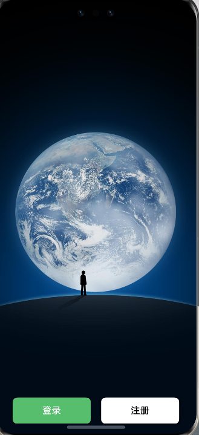</td>
    <td>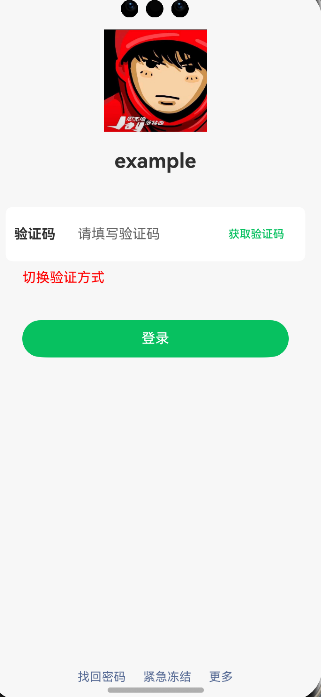</td>
    <td>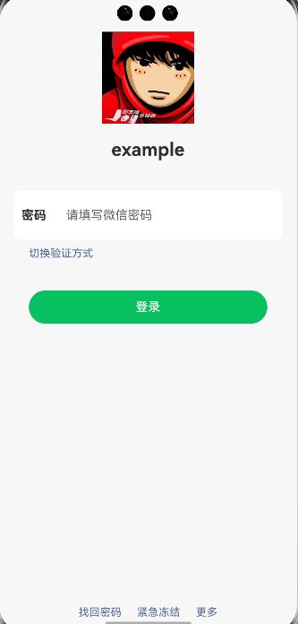</td>
    <td>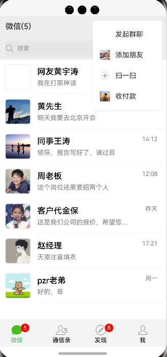</td>
  </tr>
  <tr>
    <td>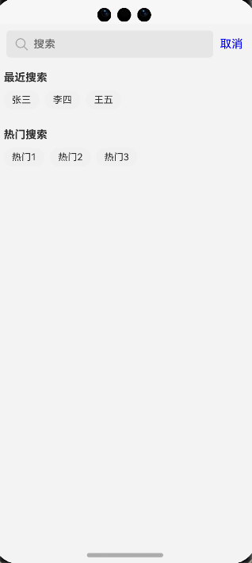</td>
    <td>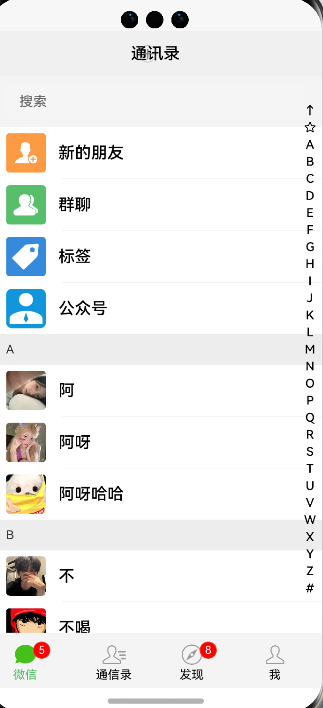</td>
    <td></td>
    <td>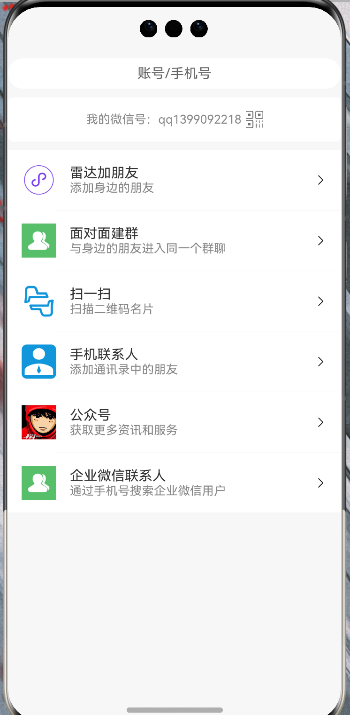</td>
    <td></td>
  </tr>
  <tr>
    <td>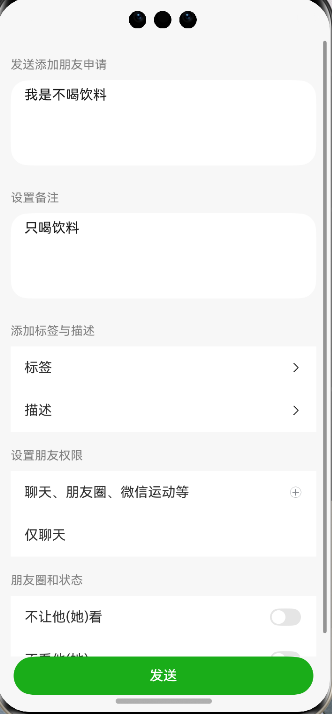</td>
    <td></td>
    <td>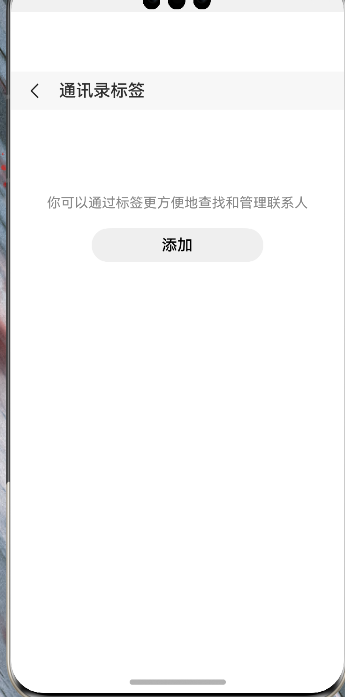</td>
    <td>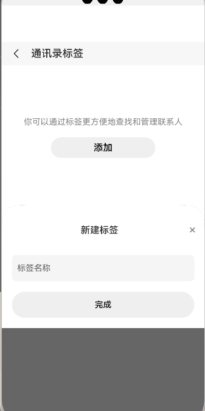</td>
    <td>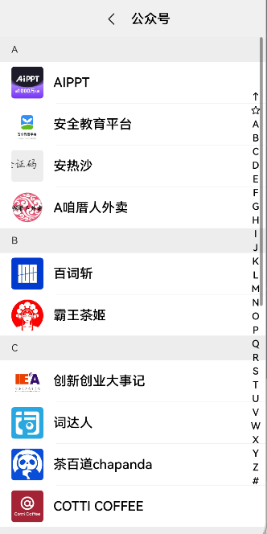</td>
  </tr>
  <tr>
    <td></td>
    <td>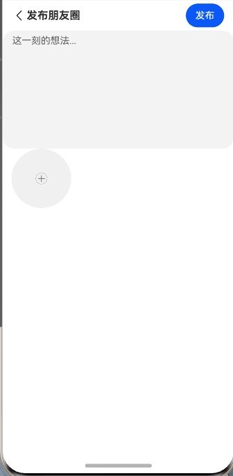</td>
    <td></td>
    <td>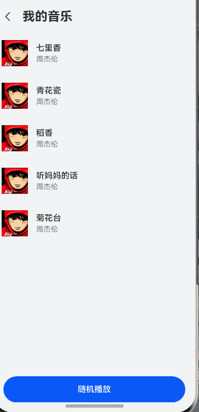</td>
    <td>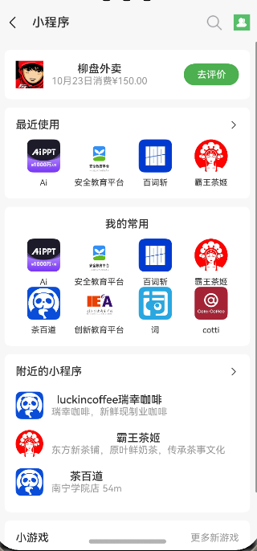</td>
  </tr>
  <tr>
    <td>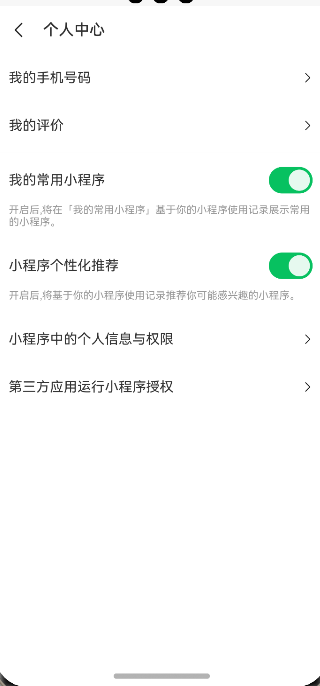</td>
    <td></td>
    <td>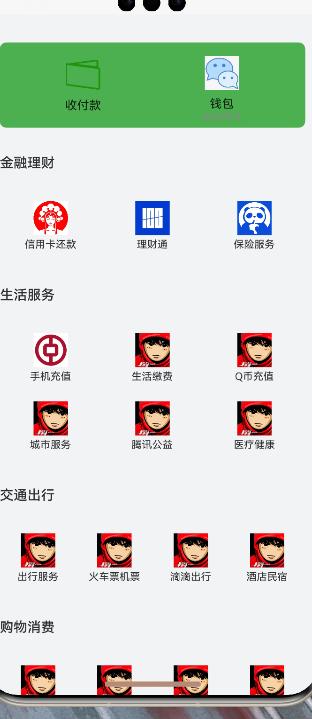</td>
    <td></td>
    <td></td>
  </tr>
</table>

## 🛠 技术栈

- ArkTS
- HarmonyOS SDK API 12
- DevEco Studio

## 🔧 安装

1. 克隆仓库git@github.com:dawdadsd/Wechat_ArktsDevelop.git
2. 使用DevEco Studio打开项目
3. 同步项目，安装依赖
4. 选择模拟器或真机设备
5. 点击运行

## 🤝 贡献

欢迎贡献、问题和功能请求！ 随时查看 [issues page](https://github.com/dawdadsd/Wechat_ArkTs/issues). 

## 📝 开发日志

查看 [Changelog](CHANGELOG.md) 获取更多信息。

## 📜 许可证

本项目仅用于学习和研究目的，不得用于商业用途。所有设计元素和功能模仿均基于对原版微信的致敬，相关权益属于腾讯公司。

## 👨‍💻 作者
巫杰龙 – jielongwu58@gamil.com

项目链接: [https://github.com/dawdadsd/WeChatArkTS](https://github.com/dawdadsd/Wechat_ArktsDevelop)

## 🙏 致谢

- 感谢所有贡献者
- 特别感谢 [HarmonyOS](https://www.harmonyos.com) 提供的开发平台
