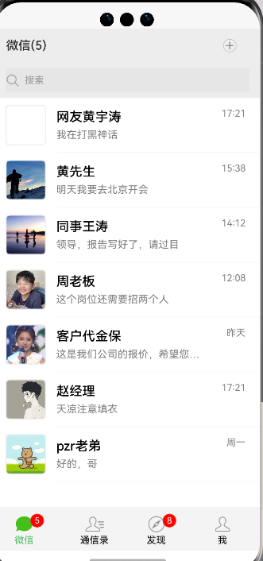
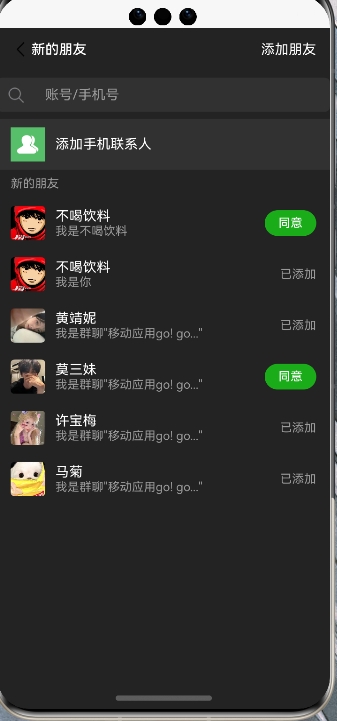
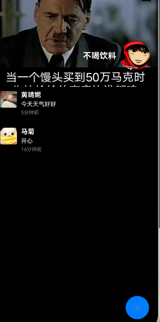

# Wechat ArkTS 开发项目

这是一个使用 最新版api12集成的ArkTS 开发的高仿微信项目，实现了多种功能和界面设计。

## 功能描述与截图

### 1. 主界面与导航

主界面展示了应用的核心功能和导航选项。

<table>
  <tr>
    <td></td>
    <td></td>
    <td></td>
  </tr>
</table>

### 2. 聊天列表

展示用户的聊天记录和联系人列表。

<table>
  <tr>
    <td></td>
    <td></td>
    <td></td>
  </tr>
</table>

### 3. 消息界面

用户可以在此查看和发送消息。

<table>
  <tr>
    <td></td>
    <td></td>
    <td></td>
  </tr>
</table>

### 4. 联系人与个人资料

管理和查看联系人信息，以及个人资料。

<table>
  <tr>
    <td></td>
    <td></td>
    <td></td>
  </tr>
</table>

### 5. 更多功能界面

展示更多应用功能和选项。

<table>
  <tr>
    <td></td>
    <td></td>
    <td></td>
  </tr>
</table>

### 6. 朋友圈

浏览和发布朋友圈内容。

<table>
  <tr>
    <td></td>
    <td></td>
    <td></td>
  </tr>
</table>

### 7. 主题切换

支持明亮和暗黑两种主题模式。

<table>
  <tr>
    <td></td>
    <td></td>
    <td></td>
  </tr>
</table>

### 8. 设置与个性化

应用的各种设置选项和个性化功能。

<table>
  <tr>
    <td></td>
    <td></td>
    <td></td>
  </tr>
</table>

### 9. 用户界面元素

展示各种用户界面元素和交互设计。

<table>
  <tr>
    <td></td>
    <td></td>
    <td></td>
  </tr>
</table>

### 10. 登录和认证

用户登录和身份认证界面。

<table>
  <tr>
    <td></td>
    <td></td>
    <td></td>
  </tr>
</table>

### 11. 多媒体功能

支持图片、视频等多媒体内容的分享和查看。

<table>
  <tr>
    <td></td>
    <td></td>
    <td></td>
  </tr>
</table>

### 12. 小程序与小游戏

集成了各种小程序和小游戏功能。

<table>
  <tr>
    <td></td>
    <td></td>
    <td></td>
  </tr>
</table>

### 13. 高级功能

包括二维码扫描、支付等高级功能。

<table>
  <tr>
    <td></td>
    <td></td>
    <td></td>
  </tr>
</table>

### 14. 其他功能展示

展示其他各种功能和界面设计。

<table>
  <tr>
    <td></td>
    <td></td>
  </tr>
</table>

## 技术特点

- 使用 ArkTS 开发，提供流畅的用户体验
- 支持多主题切换，适应不同用户偏好
- 集成多种功能，包括即时通讯、多媒体分享、小程序等
- 界面设计简洁直观，操作便捷

## 开发环境

- DevEco Studio
- HarmonyOS SDK
- 鸿蒙模拟器
## 如何运行
1. 克隆本仓库
2. 使用 DevEco Studio 打开项目
3. 配置必要的开发环境和依赖
4. 构建并运行项目
## 贡献
欢迎提交问题和改进建议。如果你想为项目做出贡献，请提交 Pull Request。
